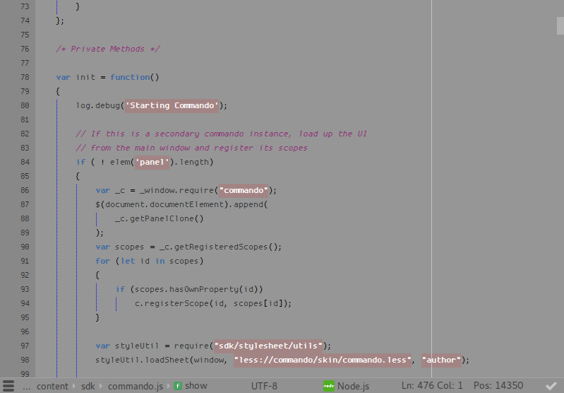

The preview on the komodo packages site will likely not be very accurate, this scheme is a bit "special".

I came across the MagicWB Amiga colorscheme a while ago and was immediately drawn to how ugly it was. I mean seriously, it has pinkish/beige string highlights. I don't know what it was that drew me to it, but something about it just felt really "authentic".

So I replicated it to Komodo, made a few adjustments and started using it. I quite enjoyed it for a few weeks but eventually reverted back to dark schemes.

Hopefully someone else will get some use out of this.

## Screenshot

I used Proggy square for the screenshot

